# GIT
# 1.Cài đặt
Dowload tại: [Git](https://git-scm.com/downloads)
Tiếp tục cài đặt bằng cách nhấn next đến cuối cùng và hoàn thành bằng finish

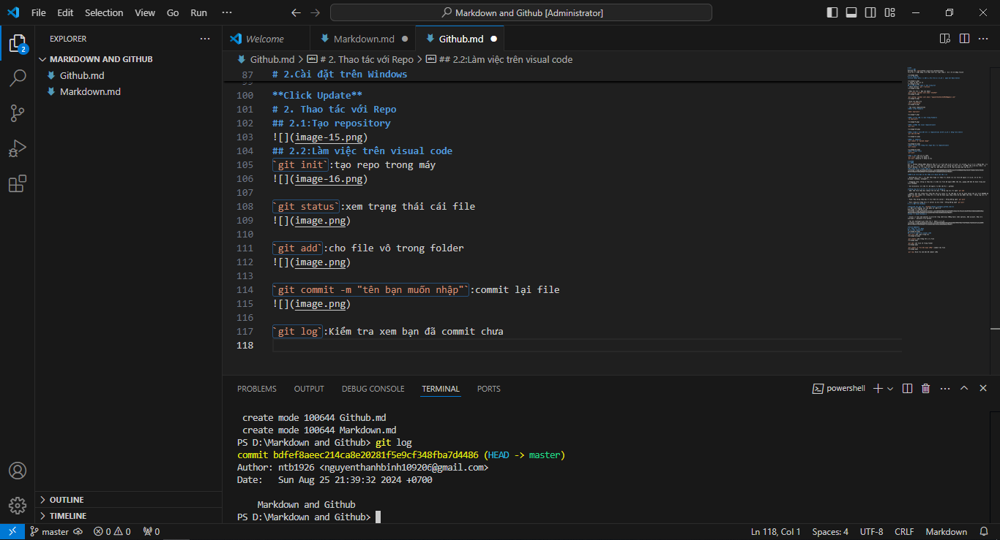
# 2.Sử dụng Git
**click chuột phải vào bắt kì đâu trên màn hình và open Git Base here** 

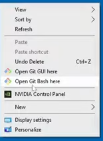
và hiện ra một cửa sổ 
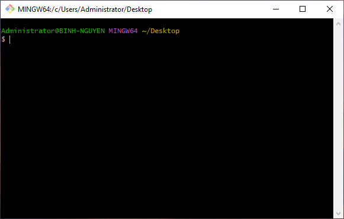
## 2.1:Những câu lệnh cơ bản trong Git
- Check version `git --version`
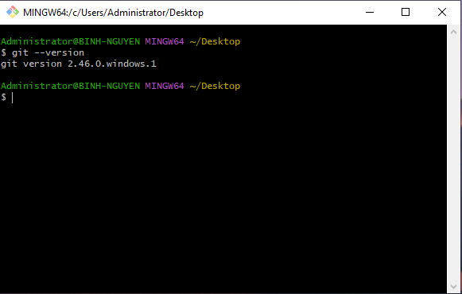

- khai báo tên và địa chỉ email
`git config --global user.name "ntb1926"`
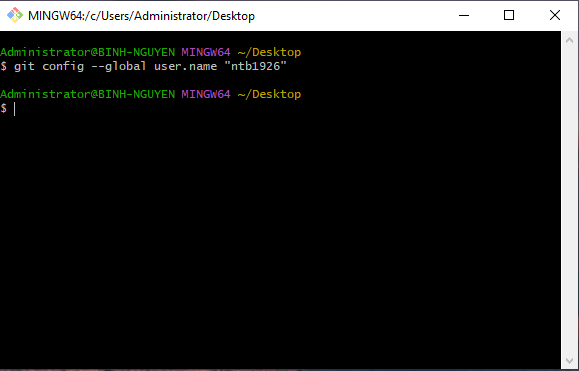

`git config --global user.email "nguyenthanhbinh109206@gmail.com"`
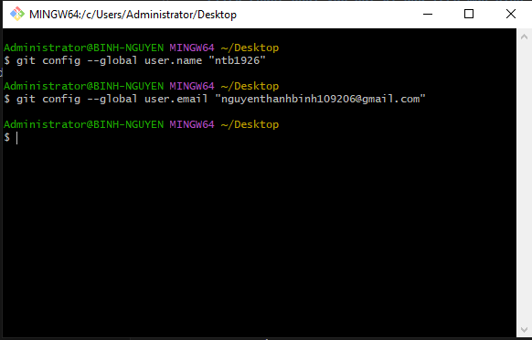

- Kiểm tra khai báo
`cat ~/.gitconfig`
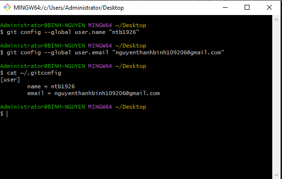

- Tạo local repositories
**Bước 1:Tạo Folder**

`mkdir myproject`

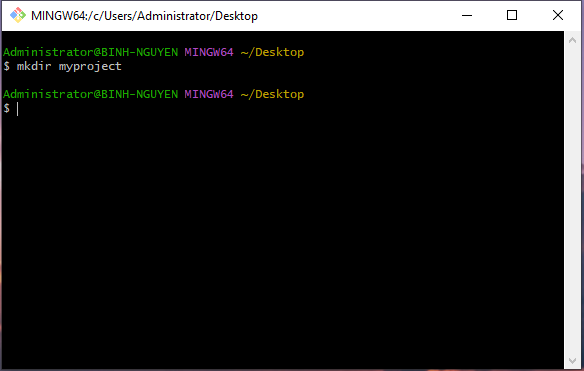

**Bước 2:Truy cập vào bên trong Folder**
`cd myproject/`

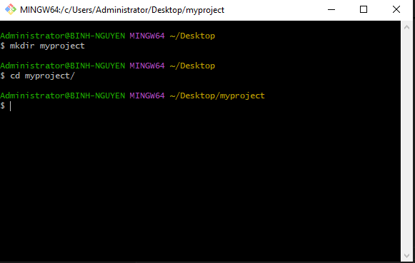

**Bước 3:Khởi tạo local repositories**
`git init`

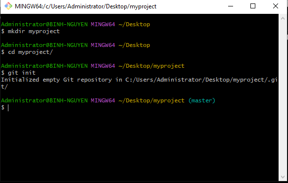

**Bước 4:Add 1 file bất kỳ vào repositories (ở đây mình sử dụng file ảnh)**
`git add anh.PNG`

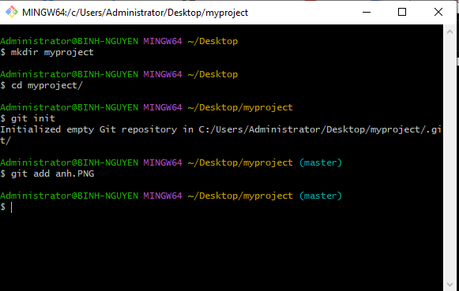

**Bước 5: Commit**
`git commit -m "upload image"`

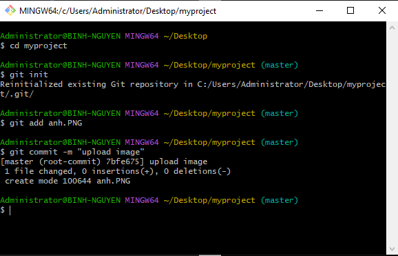
**Bước 6:Kiểm tra trạng thái hiện tại của repositories**
`git status`

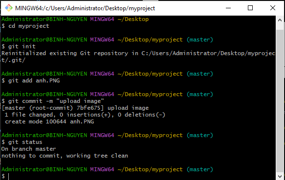
**Bước 7:Push lên**
`git push`

**Ngoài ra** còn có các lệnh
`git clone`:copy trên mạng về
`git pull`:đồng bộ từ mạng về máy

# GITHUB
# 1.REPO
Git và Github thường được dùng để lưu trữ các file cấu hình của mình, các script, viết các bài hướng dẫn, các bản nháp,... Các repo là những nơi phân loại, lưu trữ những thứ bên trên và nó được lưu cả ở máy trạm và ở server github. Để làm việc với repo thì bạn phải hiểu về nó. Một số điều bạn cần biết là:
**Ba trạng thái của một repo:**

**Như hình trên bạn có thể thấy có 3 điểm cần lưu ý:**

- Working dir: đây là nơi bạn thực hiện các thao tác chỉnh sửa với file mã nguồn của mình, nó có thể là eclipse, netbean, notepad++,...

- Stagging area: những sự thay đổi của bạn với file mã nguồn được lưu lại, giống như bạn ấn Save trong một file notepad.

- Git directory: nơi lưu trữ mã nguồn của bạn (ở đây là github)

**Tương ứng với 3 vị trí này ta có các hành động:**
- Add: lưu file thay đổi (mang tính cục bộ) - tương ứng với câu lệnh `git add`

- Commit: Ghi lại trạng thái thay đổi tại máy local (ví dụ như bạn có thể ấn Save nhiều lần với file README.md nhưng chỉ khi commit thì trạng thái của lần ấn Save cuối cùng trước đó mới được lưu lại) - tương ứng với câu lệnh `git commit`

- Push: Đẩy những thay đổi từ máy trạm lên server - tương đương lệnh `git push`

- Pull: đồng bộ trạng thái từ server về máy trạm - tương đương lệnh `git pull`
# 2.Cài đặt trên Windows

**Download tại địa chỉ: [Github](https://windows.github.com/)**
Cài đặt bình thường, yêu cầu phải có .NET 4.5
Giao diện của chương trình:

**Thêm tài khoản Github:**

- Click vào tool and options (hình bánh răng cạnh biểu tượng Sync) chọn options, Add account. Khai báo username và password trên github.

- Tại mục Configure git thêm Tên và email của mình

**Click Update**
# 2. Thao tác với Repo 
## 2.1:Tạo repository
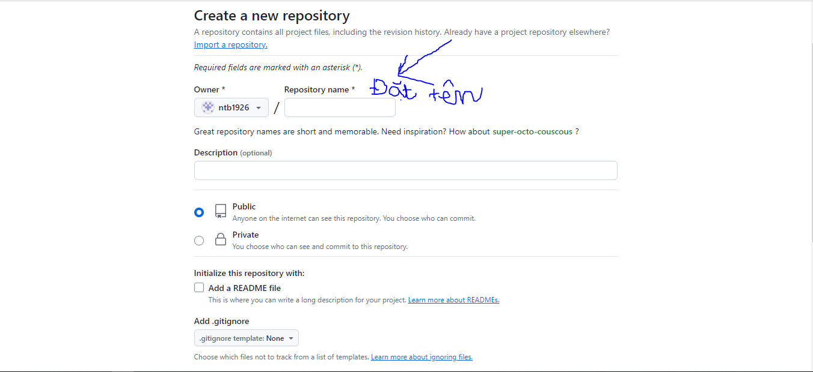
## 2.2:Làm việc trên visual code
`git init`:tạo repo trong máy
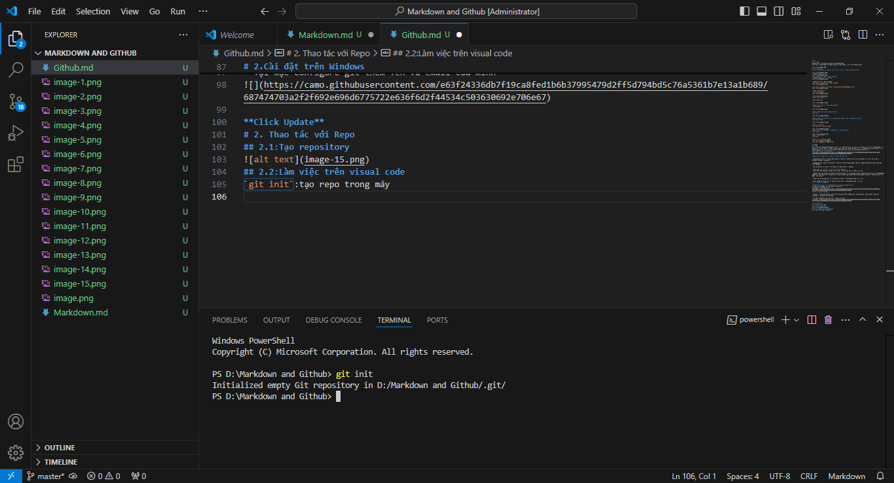

`git status`:xem trạng thái cái file

`git add`:cho file vô trong folder

`git commit -m "tên bạn muốn nhập"`:commit lại file

`git log`:Kiểm tra xem bạn đã commit chưa

`git remote add origin https://github.com/ntb1926/Markdown-and-Github.git`:đồng bộ lên trên mạng

`git push -u origin master`:push lên repo của github

`git pull`:đồng bộ trên github về visual code.

`echo "github.md" >> README.md`:đổi file trên visual code sang file README.md trên github
